# Comprehensive Technical Analysis: square/okhttp

## Repository Overview

**Repository:** square/okhttp  
**Description:** Square's meticulous HTTP client for the JVM, Android, and GraalVM.  
**Language:** Kotlin  
**Stars:** 46,658  
**Forks:** 9,242  
**Topics:** java, android, kotlin, graalvm  
**License:** Apache License 2.0  
**Size:** 59,939 KB  
**Analysis Date:** 2025-09-27 17:29:53  

## 🏗️ System Architecture

This section contains Mermaid diagrams that visualize the system architecture. 
Copy the diagram code to [Mermaid Live](https://mermaid.live) to view the interactive diagrams.

### Overall System Architecture

### API Flow Diagram

### Component Architecture

```mermaid
graph TB
    subgraph "Core Components"
        OkHttpClient["OkHttpClient<br/>• Configuration<br/>• Resource Management<br/>• Factory Methods"]
        RequestResponse["Request/Response<br/>• Immutable Data<br/>• Builder Pattern<br/>• Tag System"]
        Call["Call Interface<br/>• Execution Models<br/>• Cancellation<br/>• Cloning"]
    end

    subgraph "Interceptor System"
        InterceptorChain["Interceptor Chain<br/>• Recursive Processing<br/>• Timeout Management<br/>• Context Passing"]
        AppInterceptors["Application Level<br/>• Authentication<br/>• Logging<br/>• Custom Logic"]
        NetworkInterceptors["Network Level<br/>• Protocol Specific<br/>• Connection Aware<br/>• Raw Network Access"]
    end

    subgraph "Connection Management"
        ConnectionPool["Connection Pool<br/>• Route-based Pooling<br/>• Idle Management<br/>• Health Checking"]
        RealConnection["Real Connection<br/>• Socket Management<br/>• Protocol Negotiation<br/>• Multiplexing"]
        Exchange["Exchange<br/>• Request/Response Cycle<br/>• Protocol Abstraction<br/>• Resource Cleanup"]
    end

    subgraph "Protocol Implementations"
        Http1Codec["HTTP/1.1 Codec<br/>• Keep-Alive<br/>• Chunked Transfer<br/>• Trailer Headers"]
        Http2Codec["HTTP/2 Codec<br/>• Stream Multiplexing<br/>• Flow Control<br/>• Header Compression"]
        WebSocketImpl["WebSocket<br/>• Frame Processing<br/>• Extension Support<br/>• Ping/Pong Handling"]
    end

    subgraph "Security Components"
        TLSHandling["TLS/SSL<br/>• Certificate Pinning<br/>• Hostname Verification<br/>• Protocol Selection"]
        Authentication["Authentication<br/>• Challenge Processing<br/>• Credential Management<br/>• Proxy Support"]
    end

    subgraph "Utility Components"
        Cache["HTTP Cache<br/>• RFC 7234 Compliance<br/>• Disk Storage<br/>• Memory Optimization"]
        EventSystem["Event Listeners<br/>• Lifecycle Events<br/>• Performance Metrics<br/>• Debug Information"]
        TaskRunner["Task Runner<br/>• Background Tasks<br/>• Thread Management<br/>• Scheduling"]
    end

    OkHttpClient --> Call
    OkHttpClient --> ConnectionPool
    Call --> InterceptorChain
    InterceptorChain --> AppInterceptors
    InterceptorChain --> NetworkInterceptors
    InterceptorChain --> Exchange
    Exchange --> RealConnection
    RealConnection --> Http1Codec
    RealConnection --> Http2Codec
    RealConnection --> WebSocketImpl
    RealConnection --> TLSHandling
    OkHttpClient --> Authentication
    OkHttpClient --> Cache
    OkHttpClient --> EventSystem
    OkHttpClient --> TaskRunner
```

### Data Flow Architecture

## 🌐 API & Integration Analysis

### API Endpoints

1. **GET** `Unknown`
2. **GET** `Unknown`
3. **GET** `Unknown`
4. **GET** `Unknown`
5. **GET** `Unknown`

### External Services & Integrations

- {'type': 'DNS Resolution', 'description': 'System DNS or custom Dns implementation for hostname resolution', 'interfaces': ['Dns.SYSTEM', 'Custom Dns implementations']}
- {'type': 'Socket Connections', 'description': 'Platform socket implementations for network connectivity', 'interfaces': ['SocketFactory', 'SSLSocketFactory', 'Proxy connections']}
- {'type': 'Certificate Authorities', 'description': 'X.509 certificate validation and trust management', 'interfaces': ['X509TrustManager', 'CertificateChainCleaner', 'Platform CA stores']}
- {'type': 'Authentication Systems', 'description': 'Integration with system authentication mechanisms', 'interfaces': ['java.net.Authenticator', 'Custom Authenticator implementations']}
- {'type': 'Cache Storage', 'description': 'Disk-based HTTP response caching', 'interfaces': ['File system', 'Custom cache implementations']}

### Authentication Methods

- {'method': 'Basic Authentication', 'implementation': 'Credentials.basic() helper method', 'description': 'RFC 7617 HTTP Basic Authentication with automatic Base64 encoding'}
- {'method': 'Digest Authentication', 'implementation': 'Manual implementation via Authenticator interface', 'description': 'RFC 7616 HTTP Digest Authentication support'}
- {'method': 'Bearer Token Authentication', 'implementation': 'Manual header setting', 'description': 'OAuth 2.0 and custom token-based authentication'}
- {'method': 'Certificate-based Authentication', 'implementation': 'SSLSocketFactory configuration', 'description': 'Client certificates for mutual TLS authentication'}
- {'method': 'Proxy Authentication', 'implementation': 'Automatic proxy challenge handling', 'description': 'HTTP and HTTPS proxy authentication support'}
- {'method': 'Custom Authentication', 'implementation': 'Authenticator interface implementation', 'description': 'Pluggable authentication mechanism for custom schemes'}

### Real-time Events (WebSocket)

- {'event': 'onOpen', 'parameters': 'WebSocket, Response', 'description': 'Called when WebSocket connection is established'}
- {'event': 'onMessage', 'parameters': 'WebSocket, String', 'description': 'Called when text message is received'}
- {'event': 'onMessage', 'parameters': 'WebSocket, ByteString', 'description': 'Called when binary message is received'}
- {'event': 'onClosing', 'parameters': 'WebSocket, int code, String reason', 'description': 'Called when close handshake is initiated by remote peer'}
- {'event': 'onClosed', 'parameters': 'WebSocket, int code, String reason', 'description': 'Called when WebSocket connection is closed'}
- {'event': 'onFailure', 'parameters': 'WebSocket, Throwable, Response', 'description': 'Called when WebSocket connection fails'}

## 🔧 Technical Deep Dive

### Technology Stack

**Core Language:**
- primary
- version
- target
- features

**Runtime Targets:**
- jvm
- android
- graalvm

**Networking Protocols:**
- http_versions
- websocket
- tls_versions
- compression

### Build System

- **Build Tool:** Gradle 8.x with Kotlin DSL
- **Multiplatform:** {'plugin': 'kotlin-multiplatform', 'targets': ['jvm', 'android'], 'source_sets': ['commonMain', 'commonJvmAndroid', 'jvmMain', 'androidMain']}
- **Dependency Management:** {'main_dependencies': ['org.jetbrains.kotlin:kotlin-stdlib', 'com.squareup.okio:okio (3.x)', 'org.jetbrains.kotlin:kotlin-test (test only)'], 'version_catalog': 'gradle/libs.versions.toml for centralized dependency management'}
- **Code Quality:** {'static_analysis': ['ktlint', 'detekt', 'animal-sniffer'], 'api_compatibility': 'binary-compatibility-validator', 'documentation': 'dokka for API documentation generation'}
- **Publishing:** {'repositories': ['Maven Central', 'Google Maven'], 'artifacts': ['JAR', 'AAR', 'sources', 'javadoc'], 'signing': 'GPG signing for release artifacts'}

### Performance Optimizations

- {'area': 'Connection Management', 'optimizations': ['Connection pooling with route-based partitioning', 'HTTP/2 multiplexing for reduced connection overhead', 'Keep-alive with configurable timeout', 'Automatic unhealthy connection detection and cleanup']}
- {'area': 'Memory Management', 'optimizations': ['Object pooling for frequently allocated objects', 'Okio-based efficient I/O with minimal allocations', 'Zero-copy operations where possible', 'Configurable buffer sizes for optimal memory usage']}
- {'area': 'Network I/O', 'optimizations': ['Non-blocking I/O with efficient thread utilization', 'Streaming request/response bodies to avoid buffering', 'Compression support (gzip/deflate) with smart handling', 'TCP_NODELAY and socket buffer optimization']}
- {'area': 'Protocol Efficiency', 'optimizations': ['HTTP/2 header compression (HPACK)', 'HTTP/2 flow control optimization', 'WebSocket frame batching and compression', 'Automatic protocol selection based on server capabilities']}

### Security Features

- {'feature': 'Certificate Pinning', 'implementation': 'CertificatePinner with SHA-1/SHA-256 pin support', 'description': 'Runtime certificate validation against pinned public key hashes'}
- {'feature': 'Hostname Verification', 'implementation': 'OkHostnameVerifier with RFC 2818 compliance', 'description': 'Strict hostname verification including wildcard and IP address support'}
- {'feature': 'TLS Configuration', 'implementation': 'ConnectionSpec for cipher suite and TLS version control', 'description': 'Fine-grained control over TLS settings with secure defaults'}
- {'feature': 'Certificate Transparency', 'implementation': 'Optional Certificate Transparency log verification', 'description': 'Detection of mis-issued certificates through CT log validation'}
- {'feature': 'Security Provider Support', 'implementation': 'Pluggable security providers (Conscrypt, BouncyCastle)', 'description': 'Support for modern TLS features and performance improvements'}
- {'feature': 'Proxy Security', 'implementation': 'CONNECT tunneling with authentication', 'description': 'Secure proxy traversal with credential protection'}

## 📋 Technical Report

# OkHttp Technical Architecture Analysis

## Executive Summary

OkHttp is a highly sophisticated HTTP client library that exemplifies modern software architecture principles. Built primarily in Kotlin with multiplatform support, it provides a robust, efficient, and secure HTTP client for JVM, Android, and GraalVM environments. The library demonstrates exceptional engineering quality through its immutable configuration pattern, comprehensive interceptor system, and advanced protocol implementations.

**Key Architectural Strengths:**
- **Immutable Design**: All configuration objects are immutable after construction, ensuring thread safety and predictable behavior
- **Resource Efficiency**: Sophisticated connection pooling and HTTP/2 multiplexing minimize resource usage
- **Protocol Abstraction**: Clean abstraction layer supporting HTTP/1.1, HTTP/2, and WebSocket protocols
- **Security-First**: Comprehensive security features including certificate pinning, hostname verification, and TLS configuration
- **Extensibility**: Powerful interceptor system allows for custom functionality without modifying core code

## System Architecture Deep Dive

### Core Design Patterns

**1. Builder Pattern with Resource Sharing**
OkHttp employs a sophisticated builder pattern where expensive resources (connection pools, thread pools) are shared between client instances created from the same base client. This design optimizes memory usage while maintaining configuration isolation.

**2. Interceptor Chain Pattern**
The interceptor chain implements a recursive call pattern that allows for clean separation of concerns:
- Application-level interceptors for authentication and logging
- Framework-level interceptors for caching, connection management, and protocol handling
- Network-level interceptors for low-level protocol manipulation

**3. Protocol Strategy Pattern**
The `Exchange` and `ExchangeCodec` interfaces abstract protocol-specific implementations, allowing seamless support for HTTP/1.1, HTTP/2, and WebSocket protocols through a unified API.

### Connection Management Architecture

**Connection Pool Design:**
- **Route-based Partitioning**: Connections are pooled by `Route` objects (address + proxy configuration)
- **Health Monitoring**: Automatic detection and cleanup of unhealthy connections
- **HTTP/2 Multiplexing**: Single connections can handle multiple concurrent requests
- **Configurable Limits**: Maximum idle connections and keep-alive duration are configurable

**Connection Lifecycle:**
1. Route resolution (address + proxy + DNS)
2. Connection establishment with TLS negotiation
3. Protocol selection (HTTP/1.1 vs HTTP/2)
4. Request/response exchange
5. Connection reuse or cleanup

### Security Architecture

**Multi-layered Security Approach:**
- **Certificate Pinning**: Runtime validation against pinned certificate hashes
- **Hostname Verification**: RFC 2818 compliant hostname validation
- **TLS Configuration**: Fine-grained control over cipher suites and protocol versions
- **Authentication Framework**: Pluggable authentication with built-in support for Basic, Digest, and custom schemes

**Security Best Practices Implemented:**
- Secure defaults for TLS configuration
- Automatic certificate chain cleaning
- Protection against common TLS vulnerabilities
- Support for modern security providers (Conscrypt)

## Performance Analysis

### Memory Efficiency
- **Object Pooling**: Frequent allocations are minimized through strategic object reuse
- **Okio Integration**: Efficient I/O operations with minimal garbage collection pressure
- **Zero-Copy Operations**: Direct buffer operations where possible
- **Streaming Support**: Large request/response bodies are streamed rather than buffered

### Network Efficiency
- **HTTP/2 Benefits**: Header compression, multiplexing, and flow control
- **Connection Reuse**: Keep-alive connections significantly reduce handshake overhead
- **Compression Support**: Automatic gzip/deflate handling with smart content-type detection
- **DNS Optimization**: Configurable DNS resolution with caching

### Concurrency Model
- **Thread-Safe Design**: Immutable configuration and careful synchronization
- **Asynchronous Support**: Non-blocking operations with callback-based async API
- **Resource Limits**: Configurable limits prevent resource exhaustion
- **Timeout Management**: Comprehensive timeout handling at multiple levels

## Technology Stack Assessment

### Language and Platform Choices
**Kotlin Multiplatform:**
- **Advantages**: Null safety, coroutine support, excellent Java interoperability
- **Platform Optimization**: Android-specific optimizations while maintaining JVM compatibility
- **Future-Proofing**: Native compilation support through GraalVM

**Dependency Strategy:**
- **Minimal Dependencies**: Only essential dependencies (Okio for I/O, Kotlin stdlib)
- **Version Compatibility**: Broad compatibility range to minimize dependency conflicts
- **Optional Features**: Additional features available through optional dependencies

### Build and Development Workflow

**Gradle Configuration:**
- **Kotlin DSL**: Modern build configuration with type safety
- **Multi-module Structure**: Clean separation between core, testing, and platform-specific code
- **Quality Gates**: Comprehensive static analysis and compatibility checking

**Testing Strategy:**
- **MockWebServer**: Comprehensive HTTP server simulation for testing
- **Cross-Platform Testing**: Validation across multiple JVM versions and platforms
- **Performance Testing**: Built-in benchmarking utilities
- **Flaky Test Management**: Sophisticated retry and stability mechanisms

## Scalability Considerations

### Horizontal Scaling
- **Stateless Design**: Client instances can be safely shared across threads
- **Connection Pool Efficiency**: Optimal connection reuse for high-throughput scenarios
- **HTTP/2 Multiplexing**: Reduced connection overhead for multiple concurrent requests

### Vertical Scaling
- **Memory Efficiency**: Careful memory management prevents excessive heap usage
- **CPU Optimization**: Efficient protocol implementations minimize CPU overhead
- **I/O Optimization**: Non-blocking I/O with optimal buffer management

## Areas for Improvement and Technical Debt

### Current Limitations
1. **HTTP/3 Support**: No current support for QUIC/HTTP/3 protocol
2. **Reactive Streams**: Limited integration with reactive programming models
3. **Configuration Complexity**: Advanced configuration can be complex for new users
4. **Platform Differences**: Some features have platform-specific limitations

### Recommended Enhancements
1. **HTTP/3 Implementation**: Future protocol support for improved performance
2. **Coroutine Integration**: Better Kotlin Coroutine support for modern async patterns
3. **Configuration DSL**: Simplified configuration API for common use cases
4. **Observability**: Enhanced metrics and tracing integration

## Security Recommendations

### Current Security Posture
- **Excellent Foundation**: Comprehensive security features with secure defaults
- **Regular Updates**: Active maintenance and security patch management
- **Industry Standards**: Compliance with relevant RFCs and security standards

### Additional Security Considerations
1. **Certificate Transparency**: Enhanced CT log validation
2. **HSTS Support**: Better HTTP Strict Transport Security integration
3. **OCSP Stapling**: Improved certificate revocation checking
4. **Security Headers**: Built-in support for common security headers

## Conclusion

OkHttp represents a masterclass in HTTP client library design, combining performance, security, and usability in a well-engineered package. The architecture demonstrates excellent software engineering principles with clear separation of concerns, comprehensive testing, and robust error handling. The library successfully balances simplicity for basic use cases with the flexibility required for complex enterprise applications.

**Key Success Factors:**
- **Immutable Configuration**: Ensures thread safety and predictable behavior
- **Interceptor Architecture**: Provides powerful extensibility without complexity
- **Protocol Abstraction**: Clean support for multiple HTTP versions and WebSocket
- **Security Focus**: Comprehensive security features with secure defaults
- **Performance Optimization**: Efficient resource utilization and connection management

The codebase serves as an excellent reference for building high-quality, production-ready libraries that need to handle complex networking requirements while maintaining ease of use and reliability.

## User Stories
